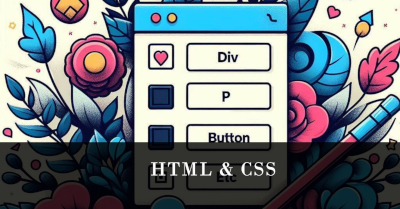
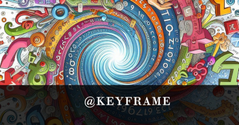

# Criando Artigos Técnicos com ChatGPT e Lexica.art

## Assunto: CSS e Keyframes

> Gere 7 headlines para nomes de artigos sobre o assunto CSS e keyframes

## Título

CSS Além do Básico: Como Utilizar Keyframes para Animações Personalizadas

## Capa

> Generate a tech banner for an article about CSS and Keyframes. Use fonts and forms to assembly moviment.

Feita com Bing e Microsoft Designer

## Ilustrações

### Bloco HTML & CSS

### Bloco @Keyframe

Image Creator:

HTML & CSS

> Crie uma arte utilizando tags html, explicitamente \
, \
, \<button>, etc.

@keyframes

> Ilustração cartoon de números, cores, códigos e fórmulas. voando quase em espiral.

Animations:

> Ilustração cartoon de tags e símbolos \
 \<h1> \<button> \<divs> etc. voando em movimento.

Prompt Inicial do Microsoft Designer:

> Create a modern tech illustration for an article about CSS animations. The style should be modern and sleek. The illustration should depict CSS animations in action.

## Blocos

Para a construção dos blocos, os comandos foram dados em partes para que o ChatGPT pudesse desenvolver melhor os aspectos de cada bloco:

Bloco 1:

    Comporte-se como um escritor de artigos web atendendo as regras abaixo. Escreva bloco a bloco, começando pelo seguinte bloco:

    - HTML e CSS
    - Explicação do que são HTML e CSS, e como se relacionam
    - Conceitos de Tag, Classe e Id
    - Utilização de Seletores CSS

    {REGRAS}

    > Preferencialmente 5 linhas para cada parágrafo. No máximo 7 linhas.
    > Utilizar um tom informal para iniciantes em programação.
    > Gerar códigos explicativos.

Bloco 2:

    Segundo bloco:

    - @Keyframes
        - Como usar
        - Sintaxe -> @keyframe identifier {}
        - Limitações

Bloco 3:

    Terceiro bloco:

    - Animation
        - Como usar
        - Explicação da Sintaxe -> animation-name duration timing-function delay iteration-count direction fill-mode;

Final:

    - gere um bloco de conclusão junto com o call action para meu github

## Checklist

- [x] Definir assunto;
- [x] Título Chamativo: Headline
- [x] Imagem de Capa Chamativa
- [x] Blocos do Artigo
- [x] Postar o artigo com um call to action

## Link do Artigo

[DIO/CSS Alem do Básico](https://web.dio.me/articles/css-alem-do-basico-como-utilizar-keyframes-para-animacoes-personalizadas)
